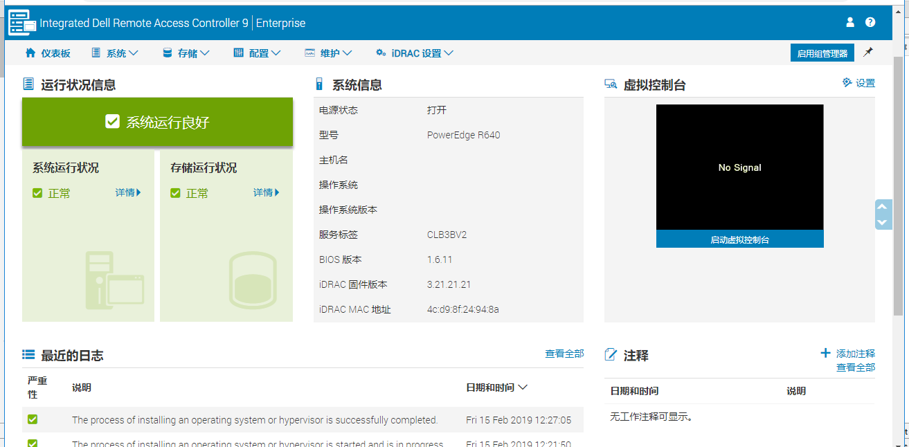

# pyidrac
由于ipmi 获取服务器硬件信息不够全面,于是自己基于iDRAC开发全新接口.
idrac服务器详细信息获取
获取数据包括(电池,mac地址,内核详情,cpu详情,内存详情,磁盘详情,系统名,操作系统类型等等)
其它数据待开发.
# 使用范围
适用于dell服务器,其他服务器资产信息待测定.我会不断的更新bug.

# python版本
python2，python3

# 使用说明
## 安装
pip install pyidrac
## 使用
from pyidrac import get_hosts_info  
z=get_hosts_info(['ip1','ip2'],"user","password")  
## 获取结果:
z.fetchone 单个结果  
z.fetchall()所有结果  
## 效果
### 原始信息

### 抓取信息

